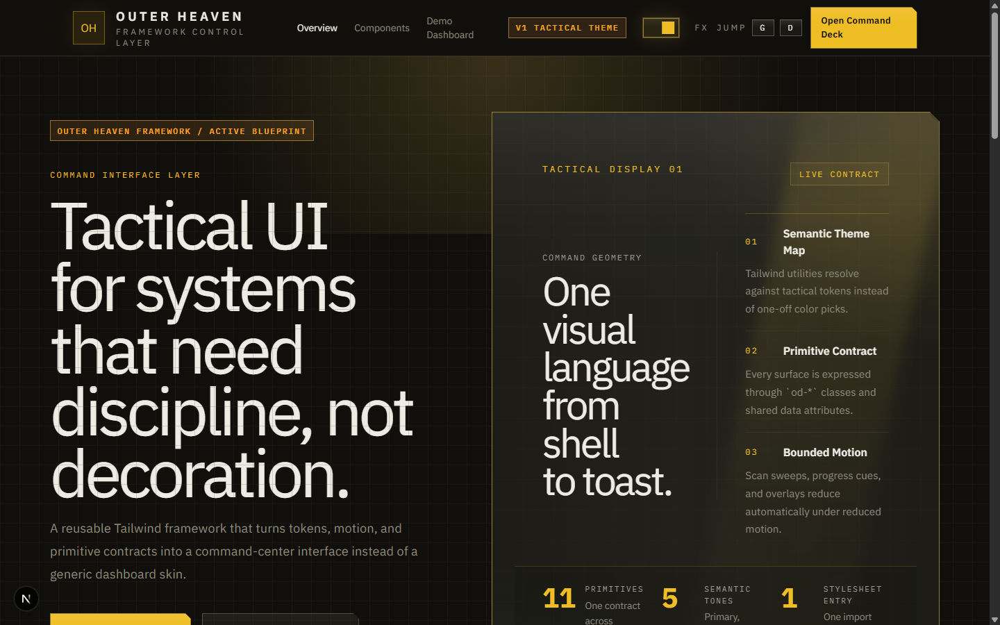
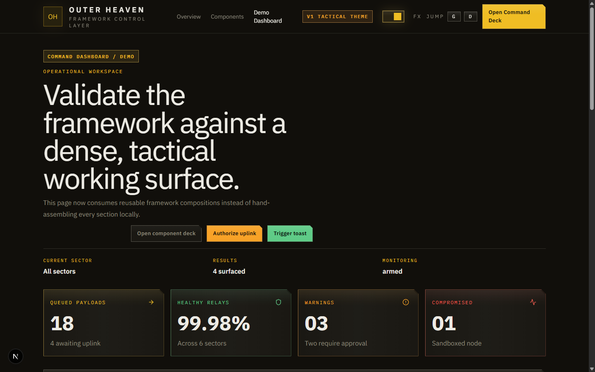

<p align="center">
  
</p>

<h1 align="center">Outer Haven Framework</h1>

<p align="center">
  <strong>A tactical Tailwind-based React design system for command-center interfaces.</strong>
</p>

<p align="center">
  <a href="LICENSE"></a>
  
  
  
  
</p>

<p align="center">
  A reusable Tailwind framework that turns tokens, motion, and primitive contracts into a command-center interface instead of a generic dashboard skin.
</p>

---

## Features

- **15+ Primitives** — Shell, Panel, Button, Input, Select, Textarea, Checkbox, Switch, Tabs, Tooltip, Badge, Dialog, Toast, Dropzone, Divider, Kbd
- **7 Compositions** — CommandHero, CommandHeader, FilterStrip, StatGrid, ActivityFeed, MissionQueue, InspectorPanel
- **OKLCh Design Tokens** — Semantic, tone-based color system with tactical theme mapping
- **Canvas 3D Transitions** — Page transitions with 4000+ grid cubes, seed-based positioning, simulated 3D rotation
- **Accessible by Default** — `prefers-reduced-motion` support, focus traps, ARIA contracts, keyboard navigation
- **Modern Stack** — React 19, Tailwind CSS 4.2, TypeScript strict, single CSS entry point

## Quick Start

```bash
pnpm add @outerhaven/framework
```

```tsx
import "@outerhaven/framework/styles.css";
import { Shell, Button, CommandHeader } from "@outerhaven/framework";

export default function App() {
  return (
    <Shell tone="primary" state="active">
      <CommandHeader
        eyebrow="Workspace"
        title="Mission intake"
        description="Compose exported patterns without rebuilding chrome."
        actions={<Button tone="primary">Launch</Button>}
      />
    </Shell>
  );
}
```

## Screenshots

| Landing Page | Dashboard |
|:---:|:---:|
|  |  |

> Run the demo locally with `pnpm dev` to explore all pages interactively.

## Components

### Primitives

| Component | Description |
|-----------|-------------|
| `Shell` | Root surface with clipped geometry and glow effects |
| `Panel` | Elevated content container with density variants |
| `Button` | Action trigger with `ghost`, `iconOnly`, `asChild`, `loading` variants |
| `Input` | Text input with `prefix`, `insetLabel`, `hint`, `message` chrome |
| `Select` | Custom combobox with keyboard navigation |
| `Textarea` | Multi-line input sharing the same visual language |
| `Checkbox` | Boolean control with error states |
| `Switch` | Toggle control with focus-visible states |
| `Tabs` | Lightweight context switcher (`Tabs`, `TabsList`, `TabsTrigger`, `TabsPanel`) |
| `Tooltip` | Non-modal hover/focus overlay |
| `Badge` | Status indicator with tone support |
| `Dialog` | Modal with focus trap, backdrop control, `Escape` dismiss |
| `Toast` | Notification system via `ToastProvider` + `useToast()` |
| `Dropzone` | File upload surface with idle/armed/uploading/success/error states |
| `Divider` | Visual separator |
| `Kbd` | Keyboard shortcut display |

### Compositions

| Component | Description |
|-----------|-------------|
| `CommandHero` | Hero banner with readouts and metadata |
| `CommandHeader` | Page header with eyebrow, title, actions, and metadata slots |
| `FilterStrip` | Search and filter control bar |
| `StatGrid` | KPI/metrics dashboard grid |
| `ActivityFeed` | Event/activity log display |
| `MissionQueue` | Operational queue with status badges |
| `InspectorPanel` | Side panel for detail inspection |

## Installation & Usage

### Prerequisites

- Node.js 18+
- pnpm 10+

### Install

```bash
pnpm add @outerhaven/framework
```

### Import styles

One import brings all tokens, theme mapping, motion rules, and component styles:

```tsx
import "@outerhaven/framework/styles.css";
```

### Semantic data attributes

Every component uses shared data attributes for cascading CSS variable overrides:

```tsx
<Button tone="primary" size="md" state="active" density="compact">
  Deploy
</Button>
```

Available tones: `primary` · `success` · `warning` · `danger` · `muted`

### Run the demo

```bash
git clone https://github.com/Sato-Isolated/outerhavenframework.git
cd outerhavenframework
pnpm install
pnpm dev
```

Open [http://localhost:3000](http://localhost:3000) to explore the landing page, component deck, and dashboard.

## Deploy to GitHub Pages

```bash
pnpm build:pages    # Static export
pnpm deploy:pages   # Push to gh-pages branch
```

Set `GITHUB_PAGES_REPO=<repo-name>` for custom repository names. Enable GitHub Pages on the `gh-pages` branch in your repository settings.

## Roadmap

The project follows a semver roadmap from the current `0.1.0`:

| Version | Milestone |
|---------|-----------|
| **0.1.0** | Foundation — tokens, primitives, compositions, demo |
| **0.2.0** | Token architecture & CSS hardening |
| **0.3.0** | Accessibility & motion audit |
| **0.4.0** | Variant completion & test coverage (90%+) |
| **0.5.0** | Composition expansion — new primitives & patterns |
| **0.6.0** | Theming & customization — multi-theme, dark/light |
| **0.7.0** | Documentation & adoption — guides, recipes, deck upgrade |
| **0.8.0** | TypeScript & DX — type safety, CI, build tooling |
| **0.9.0** | Distribution prep — npm publish, consumer testing |
| **1.0.0** | First stable release — API freeze, production-ready |

See [ROADMAP.md](ROADMAP.md) for the full detailed backlog.

## Contributing

Contributions are welcome! Here's how to get started:

```bash
git clone https://github.com/Sato-Isolated/outerhavenframework.git
cd outerhavenframework
pnpm install
pnpm dev       # Start the demo with Turbopack
pnpm test      # Run vitest suite
pnpm lint      # ESLint check
pnpm build     # Build all packages
```

1. Fork the repository
2. Create a feature branch (`git checkout -b feat/my-feature`)
3. Commit your changes
4. Open a Pull Request

## License

[MIT](LICENSE) &copy; 2026 Sato-Isolated
